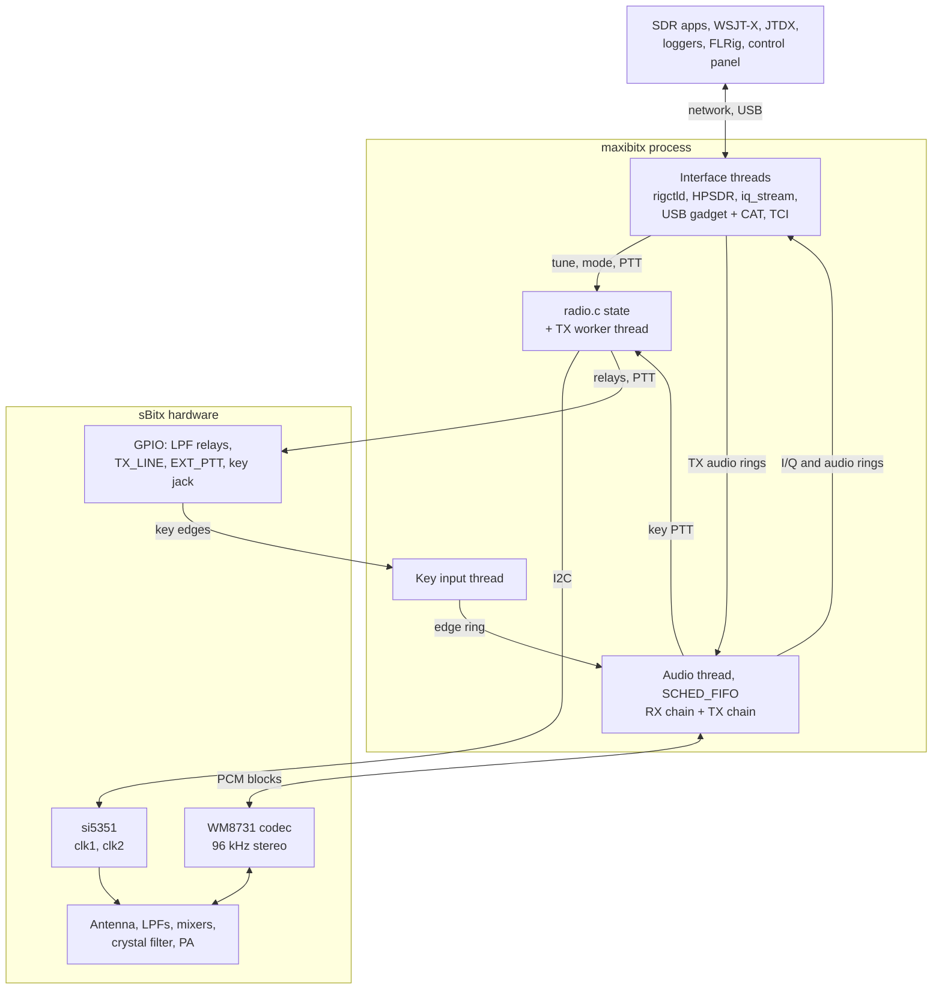
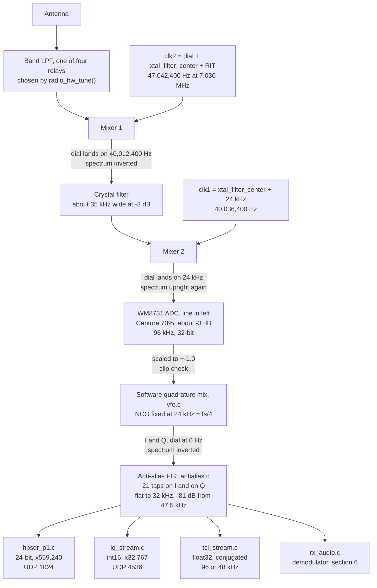
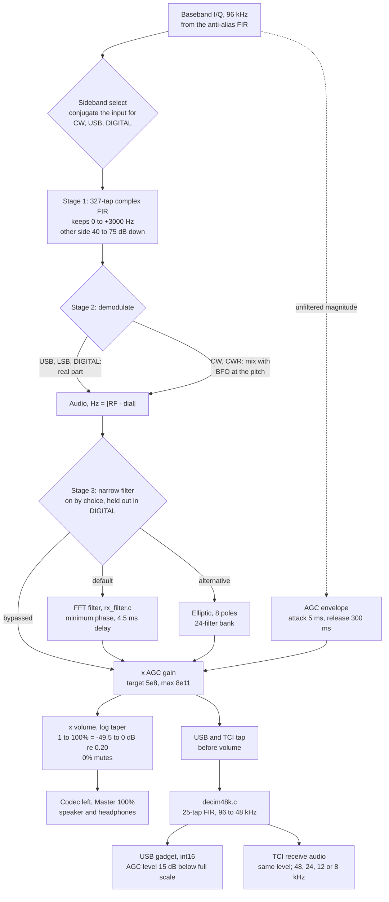
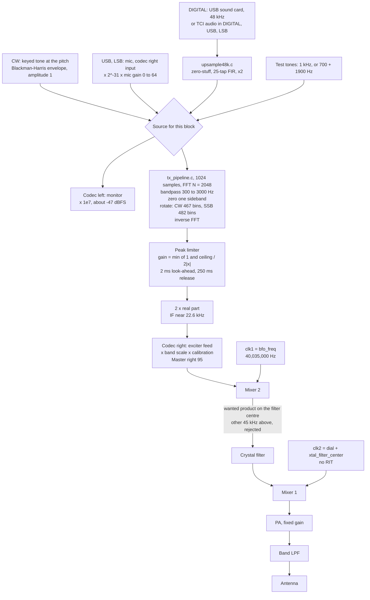

# Introduction to maxibitx

maxibitx is a headless, all-mode (CW, CWR, USB, LSB and DIGITAL) radio
daemon for the Raspberry Pi inside an
[sBitx](https://github.com/afarhan/sbitx) transceiver. It brings the
radio hardware up, runs the receive and transmit signal chains, and
serves external software over the network and over USB. It has no user
interface of its own. SDR applications, WSJT-X, loggers, FLRig and a
small desktop control panel provide the displays and the controls.

This document describes the system as it is built today. It is meant to
be read on its own: what maxibitx does, how a signal travels through it
in each direction, and how its pieces fit together are all here. The
other documents (listed in [§9](#9-further-documentation)) go deeper on
each part, and the design notes record the measurements and derivations
behind the numbers quoted here, but neither is needed to follow this
one.

**Contents**

1. [Overview and system architecture](#1-overview-and-system-architecture)
2. [Key features](#2-key-features)
3. [The code](#3-the-code)
4. [The sBitx hardware the pipelines run through](#4-the-sbitx-hardware-the-pipelines-run-through)
5. [Receive: antenna to I/Q](#5-receive-antenna-to-iq)
6. [Receive: demodulated audio](#6-receive-demodulated-audio)
7. [Transmit: source to antenna](#7-transmit-source-to-antenna)
8. [Testing](#8-testing)
9. [Further documentation](#9-further-documentation)
10. [Licensing and acknowledgements](#10-licensing-and-acknowledgements)

---

## 1. Overview and system architecture

### What runs on the Pi

The sBitx is a superheterodyne transceiver with a 40 MHz IF. Its main
board holds the analog radio: the band low-pass filters, two diode
mixers, a crystal filter, the power amplifier and the T/R switching. A
Raspberry Pi 4 mounted on that board supplies everything else: the
local oscillators (an si5351 clock generator driven over I2C), the relay
and PTT control lines (GPIO), and a WM8731 stereo audio codec, which is
the radio's only converter between analog and digital. On receive the
codec samples a low intermediate frequency; on transmit it generates
one. Everything between those converters and the operator is software.

maxibitx is that software. It is a single Linux process, started at boot
or from a shell, that runs until it receives SIGINT or SIGTERM. It owns
the radio hardware outright: nothing else on the Pi touches the GPIO
lines, the si5351 or the codec while it runs.

### Its shape

The process is built around one real-time audio thread. Every 1024
samples (10.67 ms at the codec's 96 kHz rate) that thread reads a block
from the codec, runs the receive chain over it, builds the transmit
block if the radio is transmitting, and writes a block back to the
codec. It runs at the highest SCHED_FIFO priority and never waits on
anything slow. Its data paths to other threads are lock-free
single-producer, single-consumer ring buffers; its only lock is a brief
hand-off of a PTT change to the TX worker thread; and it writes to the
log only on rare faults, such as clipping or an overrun.

Around it sit ordinary threads that do everything slow:

- The **key input** thread sleeps on the key jack's GPIO lines and
  queues each edge, timestamped by the kernel, for the audio thread. It
  runs at SCHED_FIFO, one step below the audio thread.
- The **TX worker** carries out the transmit/receive switching sequence
  (clock changes over I2C, relay and PTT lines, codec mixer settings).
  That takes tens of milliseconds, so it can never run on the audio
  thread.
- Each **external interface** has its own threads: listeners that accept
  connections or commands, and pacers that drain the audio thread's ring
  buffers onto the network or the USB port at a steady rate.
- The **main thread**, once everything is started, sits in an idle loop
  that wakes once a second to enforce the test-tone timeout and to log
  any transmit request that was refused.



### The radio model

There is one radio state, owned by `radio.c` and shared by every
interface: one VFO frequency, one mode, a receive-only RIT offset, and a
transmit flag. A change made through any interface is the change; the
next read through any other interface sees it. The mode selects both the
onboard demodulator and the transmit source:

| Mode | Receive demodulator | Transmit source | Sent as |
|---|---|---|---|
| CW | upper side, mixed to the CW pitch | keyed tone, from the key jack or text | carrier on the dial |
| CWR | lower side, mixed to the CW pitch | as CW | as CW |
| USB | upper side, audio = RF − dial | microphone, or a TCI client's audio | upper sideband |
| LSB | lower side, audio = dial − RF | microphone, or a TCI client's audio | lower sideband |
| DIGITAL | as USB, narrow filter held out | the USB sound card's audio, or a TCI client's | upper sideband |

Transmitting is permitted only inside the frequency ranges listed as
`[tx_band]` entries in `data/hw_settings.ini`, the board's calibration
file. A request to transmit anywhere else is refused, whichever
interface it came from. (A board with no `[tx_band]` entries at all is
uncalibrated, and may transmit anywhere.)

### What it serves

The main product of maxibitx is baseband I/Q: the 96 kHz complex signal
an SDR application needs to draw a panadapter and demodulate whatever
the operator chooses. Different applications want that I/Q, and the
radio's controls, in different forms, so there are five interfaces:

| Interface | Transport | Carries |
|---|---|---|
| rigctld | TCP 4532, text | tuning, mode, PTT, RIT, levels, S-meter, keyer, CW text |
| iq_stream | UDP 4536 | raw 96 kHz I/Q in a minimal format, up to 4 subscribers |
| HPSDR Protocol 1 | UDP 1024 | I/Q, tuning and MOX for existing SDR applications, one client |
| USB gadget | the Pi's USB-C port | 48 kHz audio in and out, Kenwood TS-480 CAT |
| TCI | TCP 50001, WebSocket | control, receive and transmit audio, I/Q and CW text; 4 clients by default |

All but HPSDR are optional: if one cannot start (a port in use, no
USB device controller) maxibitx logs it and runs without it. HPSDR's
UDP port must bind, or maxibitx exits. None of the network
interfaces has authentication, so the radio belongs on a trusted
network.

### Startup and shutdown

`maxibitx.c` starts things in dependency order, each step printing an
`init:` line:

1. Read `data/hw_settings.ini`: the radio board, the crystal filter
   centre, BFO, oscillator calibration, per-band transmit scale, power
   limits, PTT delay, key debounce and TCI settings.
2. Select the board named by the file's `sbitx_version` line. Without
   that line, or with a value maxibitx does not know, it prints the
   valid lines and exits before touching any GPIO line or clock.
3. Claim the board's GPIO output lines and park them in the
   receive-safe state, with the T/R relay and PTT low.
4. Start the si5351 on the board's I2C bus, with clk1 at its receive
   frequency, and configure the INA260 power monitor if one answers.
5. Build the software oscillator's table and tune to the startup
   frequency (7.030 MHz, CW).
6. Initialise the CW tone generator and start the key input thread.
7. Initialise the receive demodulator.
8. Start rigctld, TCI, HPSDR, iq_stream, the USB gadget and its CAT
   port.
9. Configure the codec's mixer and start the audio thread.

Shutdown runs roughly in reverse: drop PTT and the relay, stop the audio
thread so nothing is producing samples, then stop CAT, the USB gadget,
HPSDR, iq_stream, TCI and rigctld.

---

## 2. Key features

### Headless by design

maxibitx runs no user interface. The sBitx's own software is one large
program in which the GTK display, the DSP and the hardware control share
threads and global state. Taking the interface out of the radio process
does two things. It frees the Pi's CPU for signal processing: the audio
thread's work for a block takes about 3 ms of its 10.67 ms budget. And
it removes a whole class of conflicts, where a display redraw, a slow
widget callback or a lock shared with the user interface delays a
real-time audio block and causes an audible or on-air glitch. Here,
nothing the operator does in any application can stall the audio
thread.

### One job per file, each written to be read

The sBitx main board fixes the shape of both signal chains: which
mixers, which filter, which converter, in which order. What software has
to do at each stage is therefore well defined, and maxibitx puts the
code for each stage in its own small file. The code that drives each
function of the radio (the clocks, the relays, the codec, the mixing,
the filters, the keying) was isolated, then scrubbed and largely
rewritten so that what each stage does, and why each number in it has
the value it does, is clear from the source. Comments describe what the
code does now; how it got there is kept in the documentation.

### One module brings the radio up and down

`maxibitx.c` is the only place that knows the order in which the
hardware and the interfaces start and stop. It calls each module's
initialisation in turn, reports each step, and on shutdown stops them
in roughly the reverse order, parking the transmitter safely first. Reading it is the
quickest way to see everything the daemon contains.

### Baseband I/Q, served several ways

The receive chain ends in baseband I/Q. The set of interfaces grew to
meet the needs of different applications, and every interface that
wants I/Q gets its own copy from the audio thread:

1. **iq_stream**, a deliberately simple, low-overhead UDP stream: send
   any datagram to subscribe, and receive 128 I/Q pairs per packet. It
   lets a small client, such as the control panel's spectrum display,
   have real I/Q without implementing a radio protocol.
2. **rigctld**, Hamlib's network rig protocol, for control: frequency,
   mode, PTT, RIT, volume, mic gain, power, S-meter, receive filters,
   keyer speed and mode, test tones, and CW text.
3. **HPSDR Protocol 1**, a subset that makes the radio look like a
   Hermes-Lite 2 receiving at 96 kHz. That is enough for SDR Console,
   SparkSDR and similar applications to show the spectrum, tune the
   radio and key it.
4. **A native USB gadget** on the Pi's USB-C port: a USB sound card
   (48 kHz, 16-bit, mono in each direction) and a USB serial port
   speaking a Kenwood TS-480 subset of CAT. A computer plugged into the
   radio sees an ordinary audio device and serial port, with no drivers
   to install.
5. **TCI** (Expert Electronics' Transceiver Control Interface) over a
   WebSocket: control, receive and transmit audio, I/Q and CW text on
   one network connection. It serves the WSJT-X Improved family, JTDX,
   MSHV, loggers, Hamlib's TCI backend, and SDR applications such as
   sdrOxide.

### Onboard demodulated audio

Some applications want audio rather than I/Q, and the radio's own
speaker should work with no computer attached. maxibitx therefore has a
simple onboard demodulator for CW, CWR, USB, LSB and DIGITAL. It has a
3 kHz-wide filter for SSB and the digital modes, high-quality narrow CW
filters with selectable pitch and width, and an AGC. Its audio goes to
the local speaker or headphones, to the USB sound card, and to TCI
clients.

### An integrated keyer with hardware-timed keying

The sBitx key jack is read through kernel-timestamped GPIO edge events,
not by polling. Each edge is placed at its own sample within the audio
block, so keying is timed to the sample (about 10 µs), not to a polling
interval. The integrated keyer offers straight key, bug, ultimatic, and
iambic A and B, at 1 to 60 WPM, and sends text from rigctld, CAT and
TCI. Keying uses a shaped Blackman-Harris envelope with a weighting
correction, so each transmitted mark is as long as the key was down.
The microphone is supported for voice, with the jack's ring contact as
its push-to-talk in USB and LSB.

### A control panel that doubles as an example

`tools/rigctl_panel.py` is a small desktop control panel, written in
Python with Tk. It was built early in development and grew with it. It
uses only maxibitx's public interfaces (rigctld for control, iq_stream
for a live spectrum and waterfall), so it works on the Pi itself or from
any computer on the network. It exercises nearly everything the radio
can do: tuning, RIT, mode, volume, the receive filters, mic gain,
transmit power, the keyer, CW text and the test tones. That also makes
it a working model for anyone building their own radio out of the
maxibitx software and sBitx hardware. Running on the zBitx, the
sBitx's smaller sibling, has not been tried; it is possible future
work.

### Safety built in

Transmitting is refused outside the calibrated bands. Output power is
held by a peak limiter whose ceiling comes from the calibration file, so
no client can drive the radio past the configured maximum. The T/R
sequence mutes the receiver before any RF exists, keys an external
amplifier's relay before RF arrives, and restores the receiver only
after the relay has settled. A test tone left on turns itself off after
30 seconds of transmitting.

---

## 3. The code

The daemon is about 11,500 lines of C in 30 files, not counting the
bench tests. The
files are grouped below by the job they do. All are in `src/`, and the
external interfaces are in `src/interfaces/`.

### Startup and shutdown

- **`maxibitx.c`**: `main()`. Brings the hardware and the interfaces up
  in dependency order, runs the idle loop (test-tone timeout, reporting
  refused PTT), and shuts everything down, roughly in reverse, on a
  signal.

### Radio state

- **`radio.c`**: the single owner of radio state: frequency, mode, RIT,
  CW pitch and the transmit flag. `radio_tune_to()` sets the first
  oscillator and the band filter. `radio_set_mode()` points the
  demodulator at the mode, and holds the narrow filter out in DIGITAL.
  `radio_set_tx()` checks that the board may transmit and that the dial
  is in a transmit band, then hands the change to the TX worker thread, which runs the T/R sequence described in
  [§7](#7-transmit-source-to-antenna).

### Hardware

- **`radio_hw.c`**: the radio board. Every difference between the
  boards maxibitx runs on is here, as one profile per board, selected by
  `hw_settings.ini`'s `sbitx_version` line: claiming the GPIO outputs at
  boot, the band low-pass filter relays, the relay half of the T/R
  sequence, whether the board may transmit, the si5351's I2C bus, and
  the INA260 monitor.
- **`gpio.c`**: a thin layer over the kernel's GPIO character-device
  interface (line requests and edge events), used for the outputs here
  and for the key jack in `key_input.c`.
- **`i2c.c`**: a thin layer over the kernel's I2C driver, used by the
  si5351 and the INA260.
- **`si5351v2.c`**: the si5351 clock generator: computes PLL and
  divider settings for a frequency against the calibrated TCXO
  frequency, and sets clk1 and clk2.
- **`hw_settings.c`**: reads `data/hw_settings.ini`, the per-board
  calibration file shared with the sBitx software: the radio board
  (`sbitx_version`, required) and optionally its I2C bus, crystal filter
  centre, BFO, oscillator calibration, the per-band transmit scale
  table, power limits, external PTT delay, key debounce and the TCI
  server settings. A key the file leaves out takes its compiled-in
  default, except `sbitx_version`, which has none.

### Real-time audio thread and codec

- **`sound.c`**: configures the WM8731's mixer controls, opens the
  capture and playback streams, and runs the audio thread. Per block, it
  mixes the IF to I/Q, filters it, hands copies to every consumer, runs
  the demodulator, polls the key, chooses the transmit source, runs the
  transmit pipeline, scales its output for the exciter, and writes the
  stereo playback block. It also recovers from ALSA overruns and
  underruns, and has optional timing reports for diagnosis.

### Receive

- **`vfo.c`**: a table-driven numerically controlled oscillator with
  sine and cosine outputs. It is the software local oscillator that
  turns the 24 kHz IF into baseband I/Q, and the audio BFO for CW.
- **`antialias.c`**: the 21-tap lowpass FIR applied to I and Q after
  mixing.
- **`rx_audio.c`**: the demodulator: the image-rejecting wide filter,
  sideband selection, CW mixing, the narrow filter (both
  implementations), AGC, S-meter and volume.
- **`rx_filter.c`**: the FFT implementation of the narrow filter,
  tunable in pitch and width and run at minimum phase, built on
  `fft_filter.c`.
- **`narrow_filter_bank.h`**: the elliptic implementation's 24
  pre-designed filters, generated by `tools/gen_narrow_filters.py`.

### Transmit

- **`cw.c`**: CW keying. Takes the key's edges each block, runs the
  keyer, generates the keyed tone with its shaped envelope, and handles
  semi break-in (PTT at key-down, held between elements). In USB and
  LSB, it treats the jack's ring as the mic PTT.
- **`key_input.c`**: the key jack. Reads both contacts as
  kernel-timestamped edges on a real-time thread, debounces them,
  detects a mono plug at startup, applies paddle reversal, and queues the edges
  for the audio thread.
- **`keyer.c`**: the keyer: straight, bug, ultimatic, iambic A and B,
  1 to 60 WPM, and queued text sent with correct letter and word
  spacing. **`keyer_straight.c`** is a straight-key-only replacement,
  selected with `make KEYER=keyer_straight`.
- **`morse.c`**: the Morse table, and the translation of each
  interface's text (rigctld, CAT, TCI) into the keyer's one internal
  form, including prosigns and in-text speed changes.
- **`tone_gen.c`**: the transmit test-tone generator: a 1 kHz tone, or a
  700 + 1900 Hz two-tone.
- **`tx_pipeline.c`**: the transmit pipeline every mode shares: the
  bandpass filter, sideband selection, the shift to the transmit IF,
  and the peak limiter.
- **`fft_filter.c`**: the FFT overlap-save filter engine that
  `tx_pipeline.c` and `rx_filter.c` are built on: Kaiser-windowed
  bandpass design, minimum-phase conversion, and block convolution with
  FFTW, each instance with its own buffers and plans.

### USB audio rate conversion

- **`decim48k.c`**: a 25-tap lowpass FIR and 2:1 decimation, taking the
  demodulated audio from 96 kHz to 48 kHz for the USB sound card and
  TCI.
- **`upsample48k.c`**: 1:2 interpolation through the same filter,
  taking 48 kHz host or TCI audio up to 96 kHz for the transmit
  pipeline.

### External interfaces

- **`interfaces/hamlib.c`**: a rigctld-compatible TCP server on port
  4532, one thread per client: a subset of Hamlib's commands plus a few
  maxibitx-specific extensions.
- **`interfaces/hpsdr_p1.c`**: openHPSDR Protocol 1 on UDP 1024:
  discovery (answering as a Hermes-Lite 2), start and stop, 24-bit I/Q
  packets paced every 1.3125 ms, and tuning and MOX from the client's
  command frames.
- **`interfaces/usb_gadget.c`**: creates the composite USB gadget
  through configfs (a UAC2 sound card and a CDC-ACM serial port), moves
  audio between the gadget's ALSA card and the audio thread, and
  implements the Kenwood CAT commands on the serial port.
- **`interfaces/iq_stream.c`**: the simple UDP I/Q stream on port 4536.
- **`interfaces/tci.c`**: the TCI protocol: the initialisation burst on
  connect, command parsing, pushing every state change to every client,
  transmit ownership, and a 5 ms service thread.
- **`interfaces/tci_cw.c`**: TCI's CW text commands (`cw_macros`,
  `cw_msg`, stop, terminal mode) and their notifications, fed to the
  keyer.
- **`interfaces/tci_stream.c`**: TCI's binary streams: receive audio,
  I/Q and transmit audio, converted to the rate and format each client
  asked for, with paced requests for transmit audio.
- **`interfaces/tci_ws.c`**: the WebSocket server TCI runs over: the
  HTTP upgrade handshake, framing, and a reader and a writer thread per
  client.

### Tools

- **`tools/rigctl_panel.py`**: the desktop control panel.
- **`tools/tci_client.py`**: a standard-library TCI client for checking
  the TCI server from a laptop: the connection burst, commands, audio
  and I/Q capture, and a transmit tone.
- **`tools/gen_narrow_filters.py`**: designs and verifies the elliptic
  filter bank.
- **`tools/check_comments.py`**: the comment-policy checker run by
  `make check-comments`.

---

## 4. The sBitx hardware the pipelines run through

Both signal chains pass through the same analog hardware, in opposite
directions. This section describes those parts and the settings
maxibitx gives them. The frequencies are those of the author's board;
each board's crystal filter centre is measured and set in
`data/hw_settings.ini`, which also names the board: `sbitx_version =
SBITX_V3` for an sBitx DE, v2 or v3.

maxibitx also has a profile for the zBitx (`sbitx_version =
SBITX_V4`), which shares this signal chain but has its own pins, LPF
plan, I2C bus and T/R switching. It is receive only for now: every
request to transmit is refused. See
[zbitx_port_study.md](dsp_design_notes/zbitx_port_study.md) §5 and §9.

### Band low-pass filters

Four relay-selected low-pass filters sit between the antenna and the
first mixer. They protect the receiver from strong signals far above
the band, and strip harmonics from the transmitter. `radio_hw_tune()`
in `radio_hw.c` selects one from the board's plan each time the radio is
tuned:

| Tuned frequency | Bands | Filter |
|---|---|---|
| below 5.5 MHz | 80, 60 m | LPF_D |
| 5.5 to 10.5 MHz | 40, 30 m | LPF_C |
| 10.5 to 18.5 MHz | 20, 17 m | LPF_B |
| 18.5 to 30 MHz | 15, 12, 10 m | LPF_A |
| 30 MHz and above | | none |

### The two mixers and the si5351

The radio converts between the operating frequency and the 40 MHz IF in
Mixer 1, and between that IF and audio in Mixer 2. The si5351 provides
both local oscillators:

- **clk2**, Mixer 1's oscillator, is always the dial frequency plus the
  crystal filter centre, so the wanted signal lands on the filter
  centre: `clk2 = freq + xtal_filter_center`, plus RIT while receiving.
  At 7.030 MHz it is 47,042,400 Hz.
- **clk1**, Mixer 2's oscillator, has two values. While receiving it is
  `xtal_filter_center + 24000` = 40,036,400 Hz, which puts the filter
  centre at a 24 kHz audio IF. While transmitting it is `bfo_freq` =
  40,035,000 Hz, deliberately about 22.6 kHz above the filter centre,
  for reasons explained in [§7](#7-transmit-source-to-antenna).

Both mixers take the difference product, oscillator minus signal, so
each one inverts the spectrum. The two inversions cancel. On receive, a
signal above the dial comes out of Mixer 2 at a higher audio IF; on
transmit, a higher audio IF goes out at a higher RF.

The si5351 runs from a TCXO whose actual frequency, measured on the
bench, is the `cal` value in `hw_settings.ini` (nominally 25 MHz). It
sits at address 0x60 on the board's I2C bus: bus 22 on the sBitx, or
the bus `hw_settings.ini`'s `i2c_bus` key names. Every clock change is an
I2C transaction, which is one reason clock changes stay off the audio
thread.

### The crystal filter

After the band filters, the radio's only analog selectivity is a
crystal filter at about 40.0124 MHz. Its measured −3 dB bandwidth is
about 35 kHz: roughly ±17.4 kHz either side of centre, where it is 3 to
4 dB down. On its upper skirt it falls to about −37 dB at +24 kHz
(interpolated) and −61 dB at +28.5 kHz; the lower skirt falls more
slowly. That width suits both
directions. On receive it passes most of the 48 kHz-wide span a 96 kHz
sampler can represent, so an SDR application gets a wide panadapter. On
transmit it passes the wanted mixer product and rejects the unwanted
one, 45 kHz away.

### The WM8731 codec

The codec has two inputs and two outputs, all sampled at 96 kHz with
32-bit words, in periods of 1024 samples:

| Codec channel | Use |
|---|---|
| Line in, left | the receive IF from Mixer 2 |
| Line in, right | the microphone |
| Output, left | the local speaker and headphone amplifier: receive audio, or sidetone and monitor while transmitting |
| Output, right | the exciter feed to Mixer 2 while transmitting; silent while receiving |

At startup `setup_audio_codec()` sets the codec's mixer controls:

| Control | Setting | Meaning |
|---|---|---|
| Input Mux | Line In | both ADC channels from the line inputs |
| Line | on | the line input switch (a switch, not a gain) |
| Capture | 70% (step 21 of 31, about −3 dB) | the only analog gain ahead of the ADC; there is no RF preamplifier |
| Mic | 50% | set for completeness; with the line input selected it is probably inert |
| Master, left | 100% | the local speaker, wide open; listening volume is set digitally |
| Master, right | 0; 95 while transmitting | the exciter feed |
| Output Mixer HiFi | on | the DAC to the outputs |
| Output Mixer Line Bypass | off | no analog path from input to output |
| Output Mixer Mic Sidetone | off | as above |

While transmitting, the receive input is cut off with the codec's
line-input mute, on the left channel only, since the right channel is
the microphone. `rx_clip_check()` watches every receive sample and logs
when the ADC clips, so a capture setting that is too hot shows up in
the log.

### Power amplifier and T/R switching

The PA has a fixed gain: output power is set entirely by the level of
the exciter feed from the codec. Two GPIO lines control the switching.
**TX_LINE** (BCM 23) operates the T/R relay, and **EXT_PTT** (BCM 12)
is the PTT line for an external amplifier or accessory. The INA260
supply monitor is configured if present, but its readings are not used
yet.

### The key jack

The stereo key jack's tip is on BCM 5 (dot, or a straight key's
contact) and its ring is on BCM 4 (dash, and the microphone's PTT
switch). Both are inputs with pull-ups, so a closed contact reads low.

---

## 5. Receive: antenna to I/Q

This section follows a received signal from the antenna to the baseband
I/Q that maxibitx serves. Two example signals travel alongside the
description: a CW signal exactly on a dial frequency of 7,030,000 Hz,
and a second one 500 Hz higher, at 7,030,500 Hz.



### Band filter and Mixer 1

The antenna feeds the band low-pass filter that `radio_hw_tune()` chose
for the dial frequency; at 7.030 MHz that is LPF_C. The filtered signal
goes to Mixer 1, whose oscillator clk2 is set by `radio_tune_to()` to
the dial frequency plus the crystal filter centre:

```
clk2 = 7,030,000 + 40,012,400 = 47,042,400 Hz
```

Mixer 1's difference product puts the dial frequency exactly on the
filter centre, and anything above the dial below it:

```
47,042,400 − 7,030,000 = 40,012,400 Hz   (on the crystal filter centre)
47,042,400 − 7,030,500 = 40,011,900 Hz   (500 Hz below the centre)
```

That is the first spectral inversion. The sum product, at about 54 MHz,
is far outside the crystal filter.

RIT shifts only this oscillator, and only while receiving: with RIT set
to +200 Hz, clk2 is 47,042,600 Hz and the signal 200 Hz above the dial
is the one that lands on the filter centre. RIT is cleared by the next
retune, and is never applied while transmitting.

### The crystal filter

The crystal filter passes about ±17.4 kHz around 40,012,400 Hz before
it is 3 to 4 dB down, and is about 37 dB down by 24 kHz above it. Both example signals
pass untouched. The filter defines the receiver's useful span: roughly
35 kHz of spectrum, centred on the dial, reaches the converter. It is
also the receiver's only analog selectivity: there is no narrower
filter anywhere ahead of the ADC, so every signal in that span reaches
the ADC together, and a strong one anywhere in it sets the level
against which the rest are received.

### Mixer 2 and the 24 kHz IF

Mixer 2's oscillator clk1 is fixed while receiving at the filter centre
plus 24 kHz, 40,036,400 Hz. Its difference product moves the filter's
output down to a low IF centred on 24 kHz:

```
40,036,400 − 40,012,400 = 24,000 Hz   (the dial)
40,036,400 − 40,011,900 = 24,500 Hz   (500 Hz above the dial)
```

That is the second inversion, and it cancels the first: a station d Hz
above the dial is at 24,000 + d Hz in the IF. The crystal filter's
passband now occupies about 6.6 kHz to 41.4 kHz, all of it below the
48 kHz Nyquist frequency of a 96 kHz sampler.

### The ADC

The IF reaches the WM8731's left line input. The codec's `Capture`
control, at 70% (step 21 of 0 to 31, about −3 dB), is the only analog
gain between the antenna and the converter. Its value is a bench
setting rather than a final calibration, which is why clipping is
watched for below. `Line` is the input's on/off switch, on.
The ADC samples at 96 kHz into 32-bit words, and the audio thread reads
1024-sample blocks, 10.67 ms each.

Each sample is scaled to a fraction of full scale (divided by 2³¹) and
checked: a sample at or above 0.999 logs a clipping warning naming the
frequency and the capture setting. Clipping is logged once when it
starts, not on every sample.

### Software quadrature mix to baseband

The audio thread multiplies each real IF sample by the sine and cosine
of a numerically controlled oscillator, `lo` in `vfo.c`, to produce I
and Q. The NCO is fixed at 24,000 Hz, a quarter of the sample rate: its
phase advances by exactly 16,384 of its 65,536 steps per sample, so its
outputs repeat every four samples and carry no frequency or phase
error. Its sine table has 2³⁰ as full scale and is normalised to 1.0,
so the mix itself has unity gain:

```
I = x · cos(2π · 24000 · t)
Q = x · sin(2π · 24000 · t)
```

For an IF component at 24,000 + d Hz, the product I + jQ has two
terms, each at half the amplitude (−6 dB) of the IF sample:

- a **difference** term at **−d Hz**, the wanted baseband signal;
- a **sum** term at 48,000 + d Hz, which folds back at the 96 kHz
  sample rate to −(48,000 − d) Hz.

The dial frequency is therefore at 0 Hz, and the 7,030,500 Hz example
signal is at −500 Hz. The baseband spectrum is **inverted**: a station
above the dial appears at a negative frequency. maxibitx deliberately
does not correct this in the shared I/Q. Each consumer handles it in
the way its client expects, as described under the consumers below.

### Anti-alias filter

Both I and Q then pass, separately, through the same 21-tap
linear-phase lowpass FIR in `antialias.c`. Its passband is flat to
32 kHz (0.015 dB ripple), and from 47.5 kHz to 48 kHz it is at least
81 dB down. Its DC gain is unity, and its delay is 10 samples (about
0.1 ms).

Its job is the sum term. For a signal near the dial the sum term lands
at about ±48 kHz, in the FIR's stopband, and is removed. For signals
further out the sum term moves inward, but even for a signal at the
crystal filter's passband edge, ±17.4 kHz from the dial, it lands beyond
±30.6 kHz, where the crystal filter passes no real signal to confuse it
with. The wanted part of the spectrum, the crystal filter's ±17.4 kHz,
is in the FIR's flat passband and is not touched.

### The baseband I/Q and its consumers

The result is 96 kHz complex baseband I/Q, dial at 0 Hz, spectrum
inverted, with about 35 kHz of the band in it. A full-scale IF sinusoid
produces a baseband component of amplitude 0.5. Every consumer gets its
own copy of each block, and any subset may be active at once. None of
them can delay the audio thread: each copies the block into its own
lock-free ring and returns, and a separate thread delivers it.

| Consumer | Format | Scaling | Orientation | Delivery |
|---|---|---|---|---|
| `hpsdr_p1.c` | 24-bit big-endian I and Q, 126 pairs per 1032-byte packet | × 559,240 (2²³/15, so baseband 1.0 is 23.5 dB below the 24-bit full scale) | as is, which SparkSDR and SDR Console expect | one packet every 1.3125 ms to the one client |
| `iq_stream.c` | int16 I and Q pairs, big-endian, 128 pairs per packet behind a 12-byte header | × 32,767 | as is; the control panel flips it for display | one packet every 1.333 ms to each of up to 4 subscribers |
| `tci_stream.c` | float32 I and Q | unity | conjugated, so a station above the dial is at a positive frequency, which sdrOxide confirms | frames of 2048 complex samples at 96 kHz, or decimated to 48 kHz on request |
| `rx_audio.c` | double | unity | compensated inside, by its sideband selection | in place, on the audio thread |

An iq_stream client subscribes by sending any UDP datagram to port 4536,
and stays subscribed by sending another at least every 5 seconds. An
HPSDR client is answered as a Hermes-Lite 2 receiving at a fixed
96 kHz; the RX1 frequency it sends retunes the radio while receiving.
TCI's 48 kHz I/Q goes through a windowed-sinc decimating lowpass
designed at startup.

---

## 6. Receive: demodulated audio

`rx_audio.c` turns the same baseband I/Q into audio for three
listeners: the radio's own speaker or headphones, the USB sound card,
and TCI clients. It runs on the audio thread, once per block, after the
I/Q consumers have taken their copies.



### Sideband selection

Stage 1, below, keeps only positive baseband frequencies, so the
demodulator chooses a sideband by deciding whether to conjugate the
input (negate Q) first. Because the baseband spectrum is inverted, the
upper side of the dial is at negative frequencies, and conjugating
brings it to the positive side. CW, USB and DIGITAL keep the upper
side, so they conjugate; LSB and CWR keep the lower side, so they do
not.

### Stage 1: the wide, image-rejecting filter

A 327-tap complex FIR selects 0 to about +3000 Hz of baseband and
rejects negative frequencies. It is a real lowpass prototype (a Remez
design passing 0 to 1500 Hz, stopping from 1900 Hz, with about 1.7 dB
of ripple and −40 dB stopband) shifted up by 1500 Hz with a complex
exponential. The result passes 0 to 3000 Hz, with transition bands
from 3000 to 3400 Hz and below 0 Hz. Rejection of the opposite side is
only a few dB right at 0 Hz, where +0 and −0 cannot be told apart,
about 10 dB at −200 Hz, and 40 to 75 dB from about −400 Hz outward. Its
delay is 163 samples, 1.7 ms.

This filter is nearly all of the receive chain's processing time, so it
runs in single precision, four taps at a time on the Pi's NEON vector
unit. Against the same filter in double precision, its response differs
by under 0.001 dB, and its rounding noise is 160 dB below full scale,
about 70 dB under the codec's own noise.

This filter sets both the SSB and digital receive bandwidth and the
opposite-sideband rejection of every mode.

### Stage 2: demodulation

- **USB, LSB and DIGITAL** take the real part of stage 1's output. A
  station d Hz from the dial, on the selected side, comes out as an
  audio tone at d Hz, exactly as a conventional SSB receiver and
  WSJT-X expect. There is no BFO and no frequency offset.
- **CW and CWR** multiply stage 1's output by a complex oscillator (a
  second `vfo.c` NCO, the audio BFO) at the CW pitch, and take the real
  part. A station on the dial is heard at the pitch, 700 Hz by default,
  and one d Hz away on the selected side at pitch + d. CWR is CW's BFO
  on LSB's side. The BFO advances every sample in every mode, so its
  phase is continuous across mode changes. Its frequency is quantised
  to 96000/65536 = 1.46 Hz steps, so 700 Hz is 698.7 Hz in practice.

### Stage 3: the narrow filter

Stage 3 is an optional narrow bandpass centred on the CW pitch. The
pitch can be set from 500 to 1000 Hz in 100 Hz steps and the width to
150, 300, 450 or 600 Hz; the default is 700 Hz and 300 Hz. Setting the
pitch moves three things together: the narrow filter, the receive BFO,
and the transmitted CW tone, with the transmit IF recalculated so the
transmitted carrier stays on the dial (see
[§7](#7-transmit-source-to-antenna)). A pitch change is refused while
transmitting.

The filter is switched in and out by the operator, and is on at
startup. In DIGITAL it is held out whatever the setting, because the
USB and TCI audio is taken after it and a digital decoder needs the
whole 3 kHz; leaving DIGITAL restores the operator's choice. In USB and
LSB it applies as set, so a narrow CW-style filter is available for
listening there too.

There are two implementations, and both run on every block so that
switching between them, or bypassing either, never clicks:

- **FFT filter (the default).** `rx_filter.c` runs `fft_filter.c`'s
  overlap-save convolution with a 4096-point FFT (23.4 Hz per bin) and
  a 3073-tap Kaiser-windowed (β = 5) bandpass, converted to minimum
  phase. Its pitch and width are continuous; the stepped values above
  are the ones the controls offer. A linear-phase filter this long
  would delay the audio by 16 ms and smear a keyed CW element's attack
  around that delay; the minimum-phase version keeps the same magnitude
  response with a group delay of about 4.5 ms, and a keyed element
  settles in 8.8 ms.
- **Elliptic filter bank.** 24 pre-designed 8-pole elliptic (Cauer)
  bandpass filters, one for each pitch and width, each four biquad
  sections. Each has a −50 dB stopband, a −3 dB width 8% wider than its
  nominal width (324 Hz for 300 Hz), and an attack of 5.2 ms at 700 Hz
  and 300 Hz. Switching between bank entries keeps the filter's state,
  so a change overshoots by at most 2 dB and settles within 14 ms.

The FFT filter is the default because its continuous tuning outweighs
the elliptic filter's slightly faster attack; the elliptic bank remains
selectable, and is used automatically for any block that is not
exactly 1024 samples long.

### Stage 4: AGC

Band levels vary over many orders of magnitude, so the audio needs
automatic gain control. The AGC measures the magnitude of the
**demodulator's input I/Q**, |I + jQ| before any of the demodulator's
filtering, with a one-pole envelope follower: 5 ms attack, 300 ms release. The gain is

```
gain = 5 × 10⁸ / envelope,   at most 8 × 10¹¹
```

and it multiplies the output of stage 3 (or stage 2, with the narrow
filter bypassed). The target of 5 × 10⁸ sits 12.6 dB below the int32
full scale of the codec's output words, leaving room for peaks above
the smoothed envelope. The maximum gain stops a near-silent input from
being raised to full-scale hiss.

Measuring the envelope before the filters makes it independent of
frequency, so the AGC cannot undo the selectivity of stages 1 and 3.
The consequence, as with a front-end AGC in an analog receiver, is
desensitisation: a strong signal anywhere in the crystal filter's
35 kHz lowers the gain for everything.

### S-meter

A second envelope follower, with the same time constants, tracks the
magnitude of stage 3's output (or stage 2's, when stage 3 is out):
what is actually audible. It is read
only and never feeds the gain. rigctld (`l STRENGTH`) reports it in dB
relative to S9, from S0 (−54 dB) to S9+60 dB; TCI reports the same
reading as dBm, taking S9 as −73 dBm. It is
relative only: S9 is placed at −40 dBFS of that envelope as a
placeholder, not a calibration against a known signal.

### Outputs and their levels

**Speaker and headphones.** The AGC output is multiplied by the volume
and clamped to ±2 × 10⁹, then written to the codec's left output, whose
`Master` level is fixed at 100%. Volume is a logarithmic control: 1% to
100% spread evenly over −49.5 dB to 0 dB relative to a maximum gain of
0.20, so each 1% is 0.5 dB, and 0% is a true mute. The default, 67%, is
0.03, comfortable listening on this hardware. The local speaker is the
only output the volume affects.

**USB sound card and TCI.** These take the audio after the AGC and
before the volume, so a host's level does not change when the operator
turns the speaker down. `decim48k.c` takes it from 96 kHz to 48 kHz
with a 25-tap lowpass FIR (passband to 15 kHz with 0.34 dB ripple, at
least 54 dB down at 24 kHz) and keeps every second sample, computing
the filter only for the samples it keeps. The USB gadget scales it to
16-bit so that the AGC target sits 15 dB below full scale; TCI sends it
at the same level, in the sample type (int16, int24, int32 or float32)
and channel count the client asks for, and decimates further to 24, 12
or 8 kHz for a client that asks.

---

## 7. Transmit: source to antenna

Every transmit mode shares one path from the audio thread to the
antenna. The modes differ only in where the audio comes from, which
sideband the pipeline keeps, and what it anchors on the dial. This
section describes the common part first (switching, the pipeline, the
scaling, the analog chain), then each source: CW, SSB, digital, and the
test tones.



### Who can key the transmitter

| Source | Modes | What is transmitted |
|---|---|---|
| Key jack, either contact | CW, CWR | the keyed tone |
| Key jack ring (mic PTT) | USB, LSB | the microphone |
| CW text: rigctld `b`, CAT `KY`, TCI `cw_macros` and `cw_msg`, the panel | CW, CWR | the keyed tone, sent by the keyer |
| rigctld `T`, CAT `TX`/`RX`/`TQ`, HPSDR MOX | any | DIGITAL: the USB sound card; otherwise silence |
| TCI `trx` | any | DIGITAL: the USB sound card; with source `tci`, that client's audio in DIGITAL, USB or LSB; otherwise silence |
| Any of the above, with a test tone on | any | the test tone |

Four rules apply to all of them:

- **The band check.** `radio_set_tx()` refuses to transmit outside every
  `[tx_band]` range in `hw_settings.ini` (when it has any), and on a
  board that may not transmit at all. The main thread logs a refusal at
  most once a second.
- **The local key wins.** While the key or the mic PTT holds the
  transmitter, PTT commands from every interface are ignored. Among TCI
  clients, the one that keyed the transmitter owns it until it
  releases it or disconnects.
- **Remote PTT in CW, USB or LSB sends nothing.** Without a key or mic
  PTT there is no audio to send in those modes, so the exciter feed is
  silent, unless (in USB or LSB) a TCI client supplies its own audio,
  or a test tone is on. The radio is switched to transmit, but no RF is produced.
- **In DIGITAL the key jack is ignored.** PTT comes only from the
  computer.

### The T/R sequence

`radio_set_tx()` sets the transmit flag at once, so every thread sees
it immediately, and hands the switching to the TX worker thread, which
runs `radio_tx_apply()`.

**Receive to transmit**

1. Mute the receive input (the codec's line-input mute, left channel),
   before any transmit RF exists.
2. Set clk1 to `bfo_freq` (40,035,000 Hz), and clk2 to the dial plus
   the crystal filter centre, without RIT.
3. Raise EXT_PTT, for an external amplifier.
4. Wait `ext_ptt_delay_ms` (20 ms by default, settable from 0 to 100 in
   `hw_settings.ini`), so an amplifier's relay has closed before RF
   arrives.
5. Raise TX_LINE: the T/R relay switches to transmit.
6. Raise the codec's `Master` right channel, the exciter feed, from 0
   to 95.

**Transmit to receive**

1. Set the exciter feed to 0.
2. Drop EXT_PTT, wait 5 ms, then drop TX_LINE.
3. Restore clk1 to its receive value (`xtal_filter_center + 24000`),
   and clk2 to the dial plus RIT.
4. Unmute the receive input, now that the relay has settled.

Meanwhile, on the audio thread, the first block of any transmission
resets the pipeline, so that block is filtered against silence rather
than the end of the previous transmission, and the limiter starts with
no gain reduction. While transmitting, the audio thread writes the
transmit signal to the codec's right channel and the monitor to its
left. While receiving, the right channel is silent.

### The shared pipeline: `tx_pipeline.c`

The pipeline takes one block of 1024 real audio samples at 96 kHz and
returns 1024 samples of a real IF signal near 22.6 kHz. It works in the
frequency domain, by FFT overlap-save convolution with N = 2048 points
(a 1024-sample block plus a 1025-tap filter, less one), so each FFT bin
is 96000/2048 = 46.875 Hz. For each block:

1. **Forward FFT** of the block, as complex samples with the imaginary
   part zero, after the previous block's overlap.
2. **Bandpass, 300 to 3000 Hz.** Multiplication by the frequency
   response of a 1025-tap, linear-phase, Kaiser-windowed (β = 5)
   bandpass filter. Its magnitude response is symmetric about 0 Hz, so
   at this point it passes both the positive and the negative
   frequencies of the band. This step sets
   the transmitted bandwidth of every mode.
3. **Sideband zero.** One half of the spectrum is set to zero: the
   negative frequencies for CW, CWR, USB and DIGITAL, the positive ones
   for LSB. What remains is an analytic (one-sided) signal. This is
   where the opposite sideband is suppressed: in software, before any
   mixing.
4. **Bin rotate.** The whole spectrum is shifted up by a whole number of
   bins, the frequency-domain equivalent of multiplying by a complex
   oscillator. The shift places the signal at the transmit IF, as
   described below.
5. **Inverse FFT**, keeping the 1024 valid output samples.
6. **Peak limiter** (below), then **twice the real part**. The real
   part of a one-sided signal carries half its energy, so the factor of
   2 keeps the pipeline at unity gain for a steady tone.

Rotating each block's spectrum by k bins also gives each block a phase
step of e^(−jπk) relative to the one before, because successive blocks
start 1024 samples, half an FFT, apart. When k is odd that is a sign
flip on every other block, so when the shift is odd the pipeline
negates every odd block; otherwise the carrier would cancel itself
block by block.

The pipeline's delay is half the filter (512 samples) plus the
limiter's look-ahead (192 samples): 704 samples, or 7.3 ms.

### Where the IF goes, and why

On transmit, Mixer 2 is a single balanced modulator with no phasing
network, so it makes both a difference and a sum product from the
codec's IF. The design puts `bfo_freq` about 22.6 kHz above the crystal
filter centre and generates the IF near 22.6 kHz. The difference
product then lands on the filter centre, and the sum product about
45 kHz above it, deep in the filter's stopband.

The rotation is chosen so the right thing lands on the filter centre:

- **CW** anchors the keyed tone itself on the dial, so a key-down
  carrier is on frequency: shift = `bfo_freq − xtal_filter_center −
  pitch` = 22,600 − 700 = 21,900 Hz, rounded to **467 bins =
  21,890.625 Hz**.
- **SSB and digital** anchor the suppressed carrier (audio 0 Hz) on the
  dial, so audio at a Hz goes out at dial + a (USB) or dial − a (LSB):
  shift = `bfo_freq − xtal_filter_center` = 22,600 Hz, rounded to **482
  bins = 22,593.75 Hz**.

Both shifts are calculated from the values loaded from
`hw_settings.ini` at startup, and the CW shift again whenever the pitch
changes. Because the rotation moves whole bins, the carrier lands
within about half a bin of exact: 6.25 Hz low for SSB, and 10.6 Hz low
for CW at 700 Hz. (The CW tone, like the receive BFO, comes from a
`vfo.c` oscillator with 1.46 Hz steps, so a 700 Hz pitch is
698.7 Hz.)

Following a CW key-down at the default pitch through the chain, on a
dial of 7,030,000 Hz:

```
pipeline:   698.7 Hz tone + 21,890.6 Hz shift  =     22,589.4 Hz IF
Mixer 2:    40,035,000 − 22,589.4              = 40,012,410.6 Hz  (wanted, on the filter centre)
            40,035,000 + 22,589.4              = 40,057,589.4 Hz  (45 kHz above the centre)
filter:     keeps 40,012,410.6 Hz; the sum product is in the stopband
Mixer 1:    47,042,400 − 40,012,410.6          =  7,029,989.4 Hz  (10.6 Hz below the dial)
```

The same arithmetic for a 1 kHz tone in USB gives an IF of
23,593.75 Hz and an output at 7,030,993.75 Hz. In LSB the kept
negative frequency gives an IF of 21,593.75 Hz and an output at
7,028,993.75 Hz. The whole 300 to 3000 Hz band falls between about
300 Hz and 3000 Hz below the filter centre (USB) or above it (LSB),
well inside the filter's flat passband.

The opposite sideband is not left to the crystal filter: it is removed
in step 3. For CW it would appear at an IF of about 21,192 Hz, an RF
about 1400 Hz below the carrier; on the bench it is 70 dB down, and on the
air a receiver tuned there heard nothing.

### The peak limiter and the power ceiling

The limiter holds the envelope of the transmitted signal at or below a
ceiling. The envelope is 2|x|, the magnitude of the still-complex
signal, which is the envelope the exciter will radiate. For each sample
the target gain is the smaller of 1 and ceiling / envelope. The gain
falls toward the target by at most 1/192 per sample, so it can cross
its whole range within the 192-sample (2 ms) look-ahead, and every
sample is delayed by that look-ahead, so the gain has always arrived
before the sample that needs it. It rises back at 1/24,000 per sample,
a 250 ms release, so it does not pump within a syllable. It only ever
reduces: quiet audio stays quiet, and a constant envelope at or below
the ceiling (a CW key-down, a steady tone) never moves the gain. The
deepest reduction in each block is reported as ALC (rigctld `l ALC`),
held and then decaying at 20 dB per second.

The ceiling, set every block, is

```
ceiling = sqrt(POWER × min(1, max_power / full_scale_power))
```

`full_scale_power` is the board's measured rated output and
`max_power` the most the operator allows, both in watts in
`hw_settings.ini` (5 and 5 on the author's board). POWER is the
operator's 0 to 100% control (rigctld `RFPOWER`, TCI `drive`). With the
two watt values equal and POWER at 100%, the ceiling is 1.0: the radio
makes rated power, and the limiter only pulls back audio driven past
full scale. Because the only gain after the ceiling is fixed, no client
can exceed `max_power`.

### From the pipeline to the exciter

The audio thread scales the pipeline's output into the codec's 32-bit
right channel:

```
sample = out × TX_SAMPLE_HEADROOM × TX_DRIVE × band_scale × TX_GAIN_CORRECTION
       = out × 10⁹ × (band_scale / 0.00115) × 0.045
```

`TX_DRIVE` (50) and `TX_SAMPLE_HEADROOM` (10⁹ / (50 × 0.00115)) cancel.
Together they anchor the scale to `HW_DEFAULT_TX_SCALE`, 0.00115, the
compiled-in band scale used when no `[tx_band]` entry matches, so that
`band_scale` acts as a dimensionless correction for each band.
`TX_GAIN_CORRECTION` (0.045) is the wattmeter calibration that turns
the pipeline's unit amplitude into rated power. `band_scale` comes from
the `[tx_band]` table in `hw_settings.ini`, and compensates the chain's
falling gain with frequency. On the author's board it runs from 0.00085
on 80 m to 0.0101 on 10 m, a range of about 21.5 dB, and gives 4.8 to
5.6 W on each of the nine bands from 80 m to 10 m. At 40 m (0.00112) a
full-scale output is about 4.4 × 10⁷, 34 dB below the codec's full
scale, and the codec's analog `Master` right control, at 95, sets the
level from there. The sample is clamped to ±2 × 10⁹.

The left channel carries the monitor: the source audio itself, not the
pipeline's output, at a fixed peak of 10⁷ (about 47 dB below full
scale), to the local speaker. It never reaches the PA.

### The analog chain

From the codec, the IF goes to Mixer 2 with clk1 at `bfo_freq`, through
the crystal filter, and to Mixer 1 with clk2 at the dial plus the filter
centre. It then passes through the PA, whose gain is fixed, and the same
band low-pass filter the receiver uses, to the antenna. Output power is
set entirely in software: by the ceiling, the band scale, the
calibration constant and the codec's `Master` right level.

### CW

**Keying.** The key input thread reads both contacts of the key jack as
GPIO edge events, each stamped by the kernel with the time it happened.
After an edge it ignores that contact for `key_debounce_ms` (3 ms by
default), which removes contact bounce without adding delay. It
recognises a mono plug present at startup (its ring is grounded for as
long as it is inserted) and ignores that contact, so a straight key on
a mono plug works. It applies paddle reversal if set. Each edge goes into a ring
for the audio thread, and in CW or CWR a closure also requests the
transmitter at once, up to a block before the audio thread would.

Once per block, the audio thread takes the edges, places each at the
sample where it happened (the codec's block boundaries are tracked
against the system clock), and passes them to the keyer, which turns
them into a key-down or key-up value for every sample of the block. The
keying therefore runs one block (10.67 ms) behind the key, with
sample-accurate timing within it.

**The keyer.** `keyer.c` offers:

- **straight**: the key follows either contact;
- **bug**: automatic dots, with the dash contact keying directly;
- **ultimatic**: the most recently closed paddle wins, and a tap of the
  other is remembered;
- **iambic A and B**: squeezing both paddles alternates dots and
  dashes; a closure of the opposite paddle during an element is
  remembered, and mode B also remembers an opposite paddle that is
  already closed when an element starts.

Speed is 1 to 60 WPM (20 by default). A dot is a one-unit mark and a
one-unit space, a dash a three-unit mark and a one-unit space. Text
from rigctld, CAT, TCI or the panel is translated by `morse.c` into one
internal form (letters, figures, punctuation, prosigns, and TCI's
in-text speed changes) and sent by the same keyer, with three units
between characters and seven between words. Using a paddle interrupts
text.

**The tone.** For each sample, `cw_get_sample()` multiplies a sine at
the CW pitch by an envelope. The envelope is the rising half of a
Blackman-Harris window, 480 samples (5 ms), read forward to rise and
backward to fall, between almost 0 (6 × 10⁻⁵, about −84 dB) and an
amplitude of exactly 1.0. Because
that shape crosses 50% late when rising and early when falling, a mark
measured between its 50% points would come out 150 samples (1.56 ms)
shorter than the key was down. So every fall is held off by those 150
samples, and the transmitted mark matches the key-down time.

**Through the pipeline.** The tone, at 500 to 1000 Hz, is inside the
300 to 3000 Hz bandpass. The pipeline keeps the positive side and
applies the CW shift, so at the default pitch the tone becomes a
22,589.4 Hz IF. A unit-amplitude tone has an envelope of exactly 1.0,
the ceiling at full power, so the limiter does nothing to CW at full
power; at reduced POWER it holds the carrier at the ceiling. The 5 ms
ramps keep the keying sidebands narrow.

**Semi break-in.** The transmitter is keyed at the first closure and
held after each key-up for a hang time, so the relay does not chatter
between elements. For a straight key it is 28 blocks, about 300 ms. For
a paddle mode or text it is at least a seven-unit word space at the
current speed, which is longer than 300 ms below about 28 WPM. When
the hang ends, the T/R sequence returns the radio to receive.

**CWR** transmits exactly as CW: a key-down carrier is on the dial
whichever sideband the receiver listens to.

**Sidetone.** The same keyed tone goes to the codec's left channel at
the fixed monitor level, so the operator hears the keying with its real
envelope and timing. The `MAXIBITX_TR_TIMING` environment variable
makes maxibitx report, for each transmission, whether the first keyed
sample reached the DAC before or after the exciter feed was raised,
which shows whether any of a first element is lost to the T/R
sequence.

### SSB (USB and LSB)

**Source and PTT.** The microphone reaches the codec's right line input
and is sampled together with the receive IF. In USB and LSB the key
jack's ring is the push-to-talk: closing it keys the transmitter and
selects the microphone as the source. Each 32-bit mic sample is scaled
to ±1.0 full scale (× 2⁻³¹) and multiplied by the mic gain, 0 to 64
(rigctld `MICGAIN`, 1 by default).

**Through the pipeline.** The 300 to 3000 Hz bandpass sets the
transmitted bandwidth. The sideband zero keeps the positive frequencies
for USB or the negative ones for LSB, so the opposite sideband is
removed before any mixing, and the SSB shift places the suppressed
carrier 6.25 Hz below the dial. Speech, unlike CW, has a varying
envelope. Peaks driven past the ceiling by a high mic gain are pulled
back smoothly by the limiter, and ALC shows by how much. Raising the
mic gain raises the average level until the limiter is working on most
syllables; the ceiling, not the mic gain, limits the peak power.

**Monitor.** A copy of the mic audio goes to the local speaker at the
fixed monitor level.

### Digital

**Sources.** In DIGITAL the transmit audio comes from the computer.
Through the USB gadget it is the host's playback stream, 48 kHz 16-bit
mono, scaled to ±1.0 full scale and read into a ring by the gadget's
reader thread. Through TCI, the client that keyed with
`trx:0,true,tci;` is sent `TX_CHRONO` requests for 1024 stereo frames
at a time and answers each with a frame of float audio, of which the
left channel is used. TCI audio also works in USB and LSB, with the
sideband following the mode; DIGITAL is always upper sideband.

**Rate conversion.** `upsample48k.c` doubles the rate. Each 48 kHz
sample becomes that sample followed by an inserted zero, both run
through the same 25-tap lowpass FIR the receive side uses for
decimation, and multiplied by 2 to restore unity gain. When the host
has not supplied enough samples, as when WSJT-X is not sending,
silence is used instead, so the filter's state stays continuous.

**Through the pipeline.** Digital audio goes through the pipeline
exactly as USB does, with the SSB shift: audio at 1500 Hz goes out
1500 Hz above the dial (less 6.25 Hz). The bandpass passes the whole
300 to 3000 Hz range WSJT-X uses. A single-tone digital signal has a
constant envelope, so with the host's audio below full scale the
limiter is idle and the output power follows the audio level; driven
above the ceiling, it is held at the ceiling. A two-way FT8 contact
through the USB gadget confirmed this path end to end.

**PTT** comes from CAT, rigctld, HPSDR MOX or TCI. The key jack is
ignored in DIGITAL.

### Test tones and two-tone

While it is on (rigctld `U TONE 1` or `2`, or the panel), `tone_gen.c`
replaces the mode's own source with a test signal:

- **Single tone**: 1 kHz at full scale. Its envelope is constant at 1.0,
  so it transmits at the ceiling: a clean carrier for checking
  frequency and calibrating power.
- **Two tone**: 700 Hz and 1900 Hz, each at half amplitude. The sum
  peaks at 1.0, the same peak envelope power as the single tone, with
  half its average power. On a spectrum analyser, the third-order
  products at 2 × 700 − 1900 = −500 Hz and 2 × 1900 − 700 = 3100 Hz
  show the linearity of the mixers and the PA.

The tones are generated in double precision with `sin()`, so their own
spurs are far below anything the PA produces. They follow the mode's
sideband: in USB and DIGITAL they go out above the dial, in LSB below,
and in CW and CWR with CW's placement. Any PTT source keys them. After
30 seconds of continuous transmission the main thread turns the tone
off and drops PTT, unless the local key is holding the transmitter.

---

## 8. Testing

The DSP, the TCI server and the board layer are tested on the bench, on
any Linux machine, without radio hardware. Each harness is a separate
make target, built outside the normal build, that links only the modules
it tests (none touch the hardware) and drives them with synthetic
signals or scripted clients, checking the results against numeric
targets. Each prints its cases and exits non-zero on a failure.

| Target | What it checks |
|---|---|
| `make test-fft-filter` | `fft_filter.c`: synthetic tones through the overlap-save filter, against passband and stopband targets in dB |
| `make test-tx-pipeline` | `tx_pipeline.c`: carrier placement for CW and SSB, opposite-sideband suppression, unity gain, phase continuity across blocks, LSB, the limiter and ceiling, placement at other pitches and board values |
| `make test-rx-filter` | `rx_filter.c`: the narrow filter's passband, stopband and retuning, linear and minimum phase |
| `make test-rx-audio` | `rx_audio.c`'s wiring: the two-pass buffering, switching between the narrow filter implementations, and the fallback for odd block sizes |
| `make test-rx-audio-impulse` | the narrow filter and the AGC together through the real demodulator: how a keyed signal's attack comes out of each filter with the AGC acting on the undelayed input |
| `make test-upsample48k` | `upsample48k.c`: passband gain and rejection of the image the zero-stuffing creates |
| `make test-cw` | `cw.c`: the keying envelope and its weighting, with key edges arriving through `key_input.c` at their own timestamps, including late capture reads and a codec clock 300 ppm off |
| `make test-key-input` | `key_input.c`: debounce, bounce trains and glitches, mono-plug detection, paddle reversal, and placing edges in blocks |
| `make test-keyer` | `keyer.c`: exact element timing in samples for golden cases, and random paddle input in every mode checked against a sample-by-sample specification model; text, spacing and speed changes |
| `make test-keyer-straight` | the same tests against `keyer_straight.c`, which must refuse what it does not offer |
| `make test-tci-ws` | `tci_ws.c` over loopback: the WebSocket handshake and its refusals, every frame length encoding, fragmentation, close, oversize and malformed frames, the client limit, and the send queue's drop policy |
| `make test-tci` | the TCI server over loopback, with the radio stubbed: a JTDX-style start-up, state echoes, PTT rules, receive audio in every format and rate, I/Q at both rates, transmit audio paced by `TX_CHRONO`, and CW text read back from what the real keyer keys |
| `make test-radio-hw` | `hw_settings.c`'s `sbitx_version` and `i2c_bus` keys and `radio_hw.c`'s board profiles, with GPIO and I2C stubbed: the pins each board claims and their levels, LPF selection, the order of the T/R relay sequence, and that the zBitx can neither be permitted to transmit nor raise TX_LINE |

`make check-comments` runs `tools/check_comments.py` over the sources,
enforcing the comment policy: comments state what the code does now,
and history belongs in the documentation.

On the radio itself, maxibitx has been checked on the air: receive
through SparkSDR, sdrOxide and the control panel; CW on frequency with
the opposite sideband inaudible and about 5 W on all nine bands; USB and
LSB from the microphone; and DIGITAL in a two-way FT8 contact through
the USB gadget. The TCI server has also been tested against Hamlib's
own TCI client, and its I/Q confirmed on the air with sdrOxide.

---

## 9. Further documentation

The `docs/` folder holds the rest of the documentation. Documents
numbered 01 to 09 describe how the code works; 10 and up describe how
to use it.

| Document | Content |
|---|---|
| [`01_hardware_init_and_control.md`](01_hardware_init_and_control.md) | GPIO, si5351 and I2C, and the WM8731 codec's bring-up |
| [`02_rx_processing_pipeline.md`](02_rx_processing_pipeline.md) | the receive chain, stage by stage |
| [`03_tx_processing_pipeline.md`](03_tx_processing_pipeline.md) | the transmit chain: sources, keying and PTT, the pipeline, power calibration, known limitations |
| [`04_remote_control_and_iq_output.md`](04_remote_control_and_iq_output.md) | how each external interface is implemented |
| [`05_process_and_threading_model.md`](05_process_and_threading_model.md) | startup, the threads, and a map for reading `sound.c` |
| [`06_api.md`](06_api.md) | the reference for external software: every interface's commands and formats, the radio model, WSJT-X setup, what is not available yet |
| [`07_build_and_deployment.md`](07_build_and_deployment.md) | building, kernel and overlay dependencies, deployment |
| [`08_troubleshooting_and_bringup.md`](08_troubleshooting_and_bringup.md) | hardware bring-up and troubleshooting |
| [`09_faq.md`](09_faq.md) | common questions, each pointing to the document with the full story |
| [`10_external_digital_modes_wsjtx.md`](10_external_digital_modes_wsjtx.md) | using maxibitx with WSJT-X and other digital-mode applications |
| [`11_general_coverage_sdr_receiver.md`](11_general_coverage_sdr_receiver.md) | using maxibitx with an SDR application as a receiver (stub) |
| [`12_simple_cw_transceiver.md`](12_simple_cw_transceiver.md) | a simple CW transceiver around maxibitx (stub) |
| [`ARCHITECTURE.md`](ARCHITECTURE.md) | the design decisions and the order the system was built in, with measurements at each step |
| [`code_comments.md`](code_comments.md) | the comment policy |
| [`dsp_design_notes/`](dsp_design_notes/) | design studies, derivations, measurements and debugging history for the DSP, the keyer and the interfaces |
| [`../tools/README.md`](../tools/README.md) | the control panel and the other tools |

---

## 10. Licensing and acknowledgements

### Licence

Some of this code was taken from [drexjj/sbitx](https://github.com/drexjj/sbitx),
which in turn acknowledges the work of Ashhar Farhan at
[github.com/afarhan](https://github.com/afarhan). Both developers have
described their software as open source. To the extent that it does not
violate those authors' rights, this project is licensed under the GNU
General Public License v3.0; the full text is in
[`LICENSE`](../LICENSE). The discovery and command handling in
`hpsdr_p1.c` is based on `hpsdrsim.c` from the piHPSDR project, which
is distributed under the GPL.

### Acknowledgements

- **Ashhar Farhan, VU2ESE**, designed the sBitx and wrote its original
  software, from which the hardware control, the oscillator code and
  the filter design techniques here descend.
- **Jesse Kujawa, W9JES**, whose 64-bit sBitx repository
  ([drexjj/sbitx](https://github.com/drexjj/sbitx)) refined and extended
  that software and was the base this code was drawn from.
- **Evan, AC9TU**, **Robert Benedict** and **Juan Agrinsoni, WP3DN**,
  for their encouragement throughout, and Evan for the crystal filter
  measurements the receive design is built on.
- The **piHPSDR** project, whose `hpsdrsim.c` showed the way for the
  HPSDR Protocol 1 interface.
- [**minibitx**](https://github.com/MikeJohnshoy/minibitx), maxibitx's
  direct predecessor, which established that the sBitx hardware can be
  run by a small, separate daemon serving external SDR applications.
